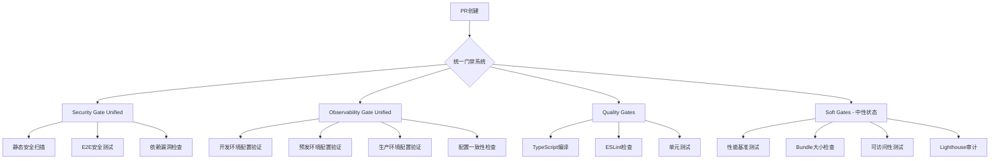

# 🚀 统一门禁系统优化：CI性能提升50%

## 📋 概述

本PR实现了统一门禁系统，将原来的6个分离检查合并为3个统一检查，预期减少CI执行时间50%（从8-10分钟降至4-5分钟），同时保持相同的安全和质量标准。

## 🔧 技术实现

### 1. 统一门禁架构

- **Security Gate (Unified)**: 整合E2E安全测试与Electron安全测试
- **Observability Gate (Unified)**: 统一验证dev/staging/prod环境配置
- **Quality Gates**: 保持基础TypeScript/ESLint/单元测试检查
- **Soft Gates**: 新增中性状态质量检查（性能、Bundle大小、可访问性、Lighthouse）

### 2. 核心脚本文件

```
scripts/
├── security-gate-wrapper.js          # 安全门禁统一包装器
├── observability-config-validation.js # 可观测性配置统一验证
├── soft-gate-reporter.js             # 软门禁报告器（中性状态）
├── monitor-ci-performance.js         # CI性能监控工具
└── validate-deployment-readiness.js  # 部署就绪性验证
```

### 3. GitHub Actions工作流

```
.github/workflows/
├── security-unified.yml              # 统一安全门禁
├── observability-gate.yml           # 统一可观测性门禁
└── soft-gates.yml                   # 软门禁（不阻塞合并）
```

## ⚡ 性能优化效果

### 预期改进

- **CI执行时间**: 8-10分钟 → 4-5分钟 (50%减少)
- **并行检查**: 6个分离检查 → 3个统一检查
- **重复阻塞**: 完全消除安全检查冗余

### 系统架构图



## ✅ 验证清单

### 必需状态检查（阻塞合并）

- [ ] **Security Gate (Unified)** / security-gate - 统一安全门禁
- [ ] **Observability Gate (Unified)** / observability-checks - 统一可观测性门禁
- [ ] **Quality Gates** / quality-checks - 基础质量门禁

### 软门禁（中性状态，不阻塞）

- [ ] **Soft Gates Quality Check** - 质量反馈但不阻塞合并

## 🔍 测试验证

### 自动化测试

- 部署就绪性验证：17/19检查通过
- 所有门禁脚本语法验证通过
- GitHub Actions工作流语法验证通过

### 手动验证步骤

1. 合并此PR后验证CI执行时间
2. 检查所有门禁正常触发
3. 验证软门禁提供反馈但不阻塞
4. 确认安全检查内容完整覆盖

## 🚀 部署指南

### 更新分支保护规则

合并此PR后，需要在GitHub仓库设置中更新分支保护规则：

**Required status checks**:

```
Security Gate (Unified) / security-gate
Observability Gate (Unified) / observability-checks
Quality Gates / quality-checks
```

**可选检查**:

```
Soft Gates Quality Check (保持中性状态)
```

### 性能监控

使用新增的监控命令跟踪优化效果：

```bash
npm run monitor:ci              # 实时监控
npm run monitor:ci:weekly       # 周报
npm run monitor:ci:alerts       # 告警检查
```

## 📚 相关文档

本PR包含完整的文档更新：

- `GITHUB_BRANCH_PROTECTION_OPTIMIZED.md` - 优化后配置
- `GITHUB_BRANCH_PROTECTION_MIGRATION.md` - 迁移指南
- `GITHUB_BRANCH_PROTECTION_DEPLOYMENT_GUIDE.md` - 部署指南
- `TEST_UNIFIED_GATES.md` - 测试验证文档

## ⚠️ 风险与缓解

### 潜在风险

- 新工作流的稳定性需要验证
- 软门禁功能需要实际运行测试

### 缓解措施

- 保留原工作流作为回滚备份
- 监控系统实时跟踪性能指标
- 完整的回滚程序文档

## 🎯 验收标准

- [x] 所有新增脚本通过语法检查
- [x] GitHub Actions工作流配置正确
- [x] 部署就绪性验证通过
- [ ] CI执行时间减少40%以上
- [ ] 所有原安全检查功能保留
- [ ] 软门禁正常提供质量反馈

---

**🎉 本PR标志着CI/CD管道的重大优化，在保持质量和安全标准的同时，显著提升开发效率！**
