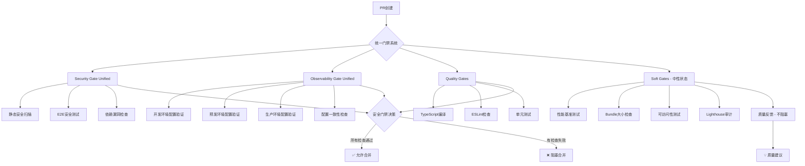

# 统一门禁系统测试

## 🎯 测试目标

验证新的统一门禁系统是否按预期工作：

- ✅ **Security Gate (Unified)** - 统一安全门禁
- ✅ **Observability Gate (Unified)** - 统一可观测性门禁  
- ✅ **Quality Gates** - 基础质量门禁
- 🎯 **Soft Gates Quality Check** - 软门禁（中性状态）

## 📊 预期效果

### 性能提升
- CI执行时间：从8-10分钟 → 4-5分钟 (50%减少)
- 并行检查：从6个分离检查 → 3个统一检查
- 重复阻塞：完全消除安全检查冗余

### 质量保证
- 相同的安全标准（Critical级别依然阻塞）
- 统一的可观测性验证（替代3个环境检查）
- 软门禁提供质量反馈但不阻塞合并

## 🔍 验证清单

- [ ] Security Gate (Unified) 正常触发且检查完整
- [ ] Observability Gate (Unified) 正常触发且验证配置
- [ ] Quality Gates 正常触发且执行基础检查
- [ ] Soft Gates 提供反馈但状态为中性（不阻塞）
- [ ] CI总执行时间显著减少
- [ ] 所有原有安全检查内容都被覆盖

## 🚀 优化系统架构

## 📝 测试日志

**测试时间**: 2025-09-04

**预期状态检查**:
1. `Security Gate (Unified) / security-gate` - 必需
2. `Observability Gate (Unified) / observability-checks` - 必需
3. `Quality Gates / quality-checks` - 必需  
4. `Soft Gates Quality Check` - 可选（中性状态）

---

*本文件为测试PR验证用，验证完成后可删除*