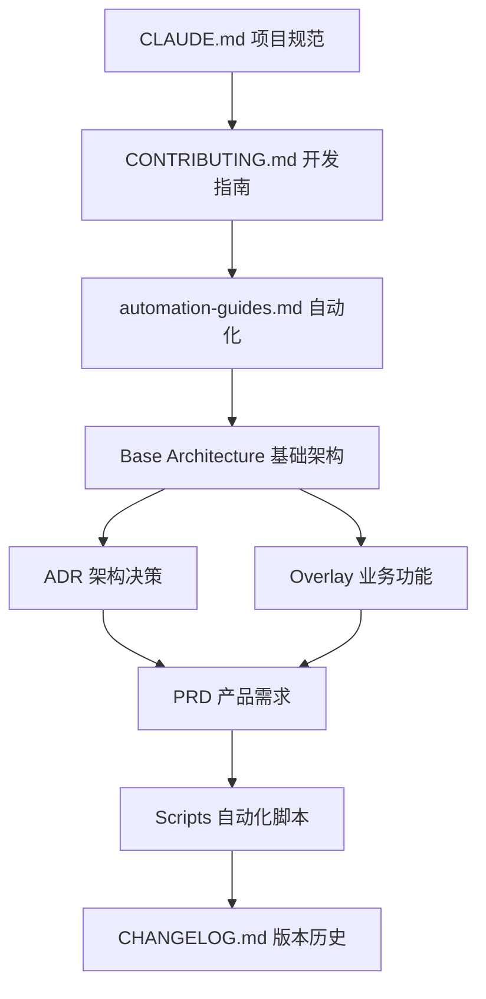

# 📚 项目文档索引

> **Vite Game Project** - 基于 Electron + React 19 + Phaser 3 + AI 协作开发模式的技术文档中心

[](../CHANGELOG.md)
[]()
[](../CHANGELOG.md)

---

## 🚀 快速开始

| 文档                                  | 描述                                | 重要性 |
| ------------------------------------- | ----------------------------------- | ------ |
| [📋 贡献指南](CONTRIBUTING.md)        | 开发流程、质量门禁、AI协作规范      | ⭐⭐⭐ |
| [🤖 自动化指南](automation-guides.md) | Claude Code CLI、本地Mock、性能测试 | ⭐⭐⭐ |
| [📝 变更日志](../CHANGELOG.md)        | AI+人类协作版本历史追踪             | ⭐⭐⭐ |
| [📖 项目规范](../CLAUDE.md)           | 项目级开发规范和质量要求            | ⭐⭐⭐ |

---

## 📖 核心架构文档

### 🏗️ 基础架构 (Base Documents)

> **跨切面系统骨干**，无PRD痕迹，使用占位符 `${DOMAIN_*}` `${PRODUCT_*}`

| 章节 | 文档                                                                                | 核心内容                             | 状态        |
| ---- | ----------------------------------------------------------------------------------- | ------------------------------------ | ----------- |
| 01   | [约束与目标](architecture/base/01-introduction-and-goals-enhanced.md)               | NFR/SLO、技术栈、质量目标            | ✅ Active   |
| 02   | [安全基线](architecture/base/02-security-baseline-electron-v2-claude.md)            | Electron安全、CSP策略、沙箱模式      | ✅ Active   |
| 03   | [可观测性](architecture/base/03-observability-sentry-logging-enhanced.md)           | Sentry集成、Release Health、监控策略 | ✅ Active   |
| 04   | [系统上下文](architecture/base/04-system-context-c4-event-flows.md)                 | C4模型、事件流、系统边界             | ✅ Active   |
| 05   | [数据模型](architecture/base/05-data-models-and-storage-ports.md)                   | 存储端口、数据建模、持久化策略       | ✅ Active   |
| 06   | [运行时视图](architecture/base/06-runtime-view-loops-state-machines-error-paths.md) | 状态机、错误路径、游戏循环           | ✅ Active   |
| 07   | [开发构建](architecture/base/07-dev-build-and-gates.md)                             | 质量门禁、CI/CD、开发工具链          | ✅ Active   |
| 08   | [功能纵切模板](architecture/base/08-功能纵切-template.md)                           | 模块开发模板和约束规范               | ✅ Template |
| 09   | [性能容量](architecture/base/09-performance-and-capacity.md)                        | 性能基准、容量规划、回归阈值         | ✅ Active   |
| 10   | [国际化运维](architecture/base/10-i18n-ops-release.md)                              | i18n框架、运维策略、发布流程         | ✅ Active   |

### 🎯 业务功能 (Overlay Documents)

> **PRD特定实现**，主要承载 08章功能纵切（UI→事件→域模型→持久化→验收）

#### 公会管理系统 (PRD-GM-GUILD-MANAGER)

| 模块        | 功能描述                     | 文档路径                                                                              | 实现状态  |
| ----------- | ---------------------------- | ------------------------------------------------------------------------------------- | --------- |
| 🏛️ 管理模块 | 公会创建、配置、权限管理     | [overlays/08-game-prd/公会管理模块/](architecture/overlays/08-game-prd/公会管理模块/) | 📋 Design |
| 👥 会员模块 | 成员招募、等级管理、权限分配 | [overlays/08-game-prd/公会会员模块/](architecture/overlays/08-game-prd/公会会员模块/) | 📋 Design |
| 🏪 后勤模块 | 资源管理、仓库系统、贸易功能 | [overlays/08-game-prd/公会后勤模块/](architecture/overlays/08-game-prd/公会后勤模块/) | 📋 Design |
| 💬 论坛模块 | 内部论坛、公告系统、消息通知 | [overlays/08-game-prd/公会论坛模块/](architecture/overlays/08-game-prd/公会论坛模块/) | 📋 Design |
| ⚔️ 战术中心 | 战略规划、任务协调、战术分析 | [overlays/08-game-prd/战术中心模块/](architecture/overlays/08-game-prd/战术中心模块/) | 📋 Design |

---

## 🏛️ 架构决策记录 (ADR)

> **已接受的架构决策**，当前有效口径，作为技术选型和实现的权威参考

| ADR                                                      | 标题                     | 决策内容                                                         | 状态        | 影响范围 |
| -------------------------------------------------------- | ------------------------ | ---------------------------------------------------------------- | ----------- | -------- |
| [ADR-0001](adr/ADR-0001-tech-stack.md)                   | 技术栈选型               | Electron + React 19 + Vite + TypeScript + Tailwind v4 + Phaser 3 | ✅ Accepted | 全栈     |
| [ADR-0002](adr/ADR-0002-electron-security.md)            | Electron安全基线         | 沙箱模式 + contextIsolation + IPC白名单                          | ✅ Accepted | 安全层   |
| [ADR-0003](adr/ADR-0003-observability-release-health.md) | 可观测性与Release Health | 基于Sentry的企业级监控策略                                       | ✅ Accepted | 监控层   |
| [ADR-0004](adr/ADR-0004-event-bus-and-contracts.md)      | 事件总线与契约           | 类型安全IPC + 领域事件 + DTO版本化                               | ✅ Accepted | 通信层   |
| [ADR-0005](adr/ADR-0005-quality-gates.md)                | 质量门禁体系             | 多维度自动化质量保证策略                                         | ✅ Accepted | CI/CD层  |

---

## 📋 产品需求文档 (PRD)

### 🧩 PRD 分片系统

> **模块化PRD管理**，支持大型产品需求的分片存储和组合

| PRD文档                                           | 分片数量 | 核心模块                     | 状态      |
| ------------------------------------------------- | -------- | ---------------------------- | --------- |
| [公会管理器](PRD-Guild-Manager.md)                | 24个分片 | 管理、会员、后勤、论坛、战术 | 📋 Design |
| [分片索引](prd_chunks/PRD-Guild-Manager_index.md) | -        | 分片导航和依赖关系           | ✅ Active |

### 📊 PRD 分片详情

详细分片列表：[prd_chunks/](prd_chunks/) 目录包含24个功能分片，每个分片专注特定功能域。

---

## 🔧 开发工具与脚本

### 📜 自动化脚本

| 脚本                                                    | 功能                      | 使用方式                            | 集成状态  |
| ------------------------------------------------------- | ------------------------- | ----------------------------------- | --------- |
| [质量门禁](../scripts/quality_gates.mjs)                | 覆盖率+Release Health检查 | `npm run guard:quality`             | ✅ CI集成 |
| [Electron安全扫描](../scripts/scan_electron_safety.mjs) | 安全配置检查              | `npm run guard:electron`            | ✅ CI集成 |
| [变更日志更新](../scripts/update-changelog.mjs)         | AI协作CHANGELOG自动化     | `node scripts/update-changelog.mjs` | ✅ 新增   |
| [Base文档清洁](../scripts/verify_base_clean.mjs)        | Base文档PRD-ID清洁检查    | `npm run guard:base`                | ✅ CI集成 |
| [版本同步](../scripts/version_sync_check.mjs)           | 版本一致性检查            | `npm run guard:version`             | ✅ CI集成 |

### 🧪 测试工具

| 测试类型 | 工具              | 命令                    | 覆盖范围             |
| -------- | ----------------- | ----------------------- | -------------------- |
| 单元测试 | Vitest            | `npm run test:unit`     | 核心逻辑、工具函数   |
| E2E测试  | Playwright        | `npm run test:e2e`      | 用户流程、界面交互   |
| 性能测试 | 自定义            | `npm run perf:*`        | 启动时间、内存、渲染 |
| 安全测试 | Electronegativity | `npm run security:scan` | Electron安全配置     |

### ⚙️ 质量门禁命令

```bash
# 完整质量检查链 (CI/CD标准)
npm run guard:ci

# 分项检查
npm run typecheck       # TypeScript类型检查
npm run lint           # ESLint代码规范
npm run test:unit      # 单元测试
npm run guard:electron # Electron安全
npm run test:e2e       # E2E测试
npm run guard:quality  # 覆盖率+Release Health
npm run guard:base     # Base文档清洁性
npm run guard:version  # 版本同步检查
```

---

## 📊 项目状态概览

### 🎯 当前版本状态

- **版本**: 0.0.0 (初始化阶段)
- **AI协作比例**: 76.4% AI实现 + 23.6% 人类审核
- **测试覆盖率**: 目标 90%+ (行覆盖率), 85%+ (分支覆盖率)
- **质量门禁**: ✅ 全部通过
- **Release Health**: 目标 Sessions ≥99.5%, Users ≥99.0%

### 🏗️ 架构完成度

| 层级          | 完成度 | 状态说明                   |
| ------------- | ------ | -------------------------- |
| 🔧 基础设施层 | 95%    | 开发环境、构建、CI/CD完备  |
| 🏗️ 架构设计层 | 90%    | Base文档完整，ADR体系健全  |
| 🎮 业务功能层 | 15%    | PRD设计完成，实现待启动    |
| 🧪 测试质量层 | 85%    | 测试框架完备，覆盖率待提升 |
| 📊 监控运维层 | 70%    | Sentry集成，性能监控待完善 |

### 📈 关键指标

- **文档数量**: 100+ 技术文档
- **ADR数量**: 5个已接受决策
- **PRD分片**: 24个功能模块
- **自动化脚本**: 10+ 质量门禁脚本
- **测试套件**: 单元测试 + E2E测试 + 性能测试

---

## 🗂️ 文档分类导航

### 📚 按文档类型浏览

#### 🏛️ 架构与设计

- **系统架构**: [architecture/base/](architecture/base/) - 10章完整架构设计
- **功能设计**: [architecture/overlays/](architecture/overlays/) - 业务功能实现方案
- **决策记录**: [adr/](adr/) - 架构决策追踪
- **设计文档**: [技术架构文档](tech-architecture-ai-first.base.md)

#### 📋 产品与需求

- **产品需求**: [PRD-Guild-Manager.md](PRD-Guild-Manager.md) - 公会管理器完整需求
- **需求分片**: [prd_chunks/](prd_chunks/) - 模块化需求管理
- **游戏设计**: [GDD-补遗-公会经理.md](GDD-补遗-公会经理.md) - 游戏设计文档

#### 🔧 开发与工具

- **开发指南**: [CONTRIBUTING.md](CONTRIBUTING.md) - 完整开发流程
- **自动化指南**: [automation-guides.md](automation-guides.md) - Claude Code CLI使用
- **思维模式**: [thinking-modes-guide.md](thinking-modes-guide.md) - AI思维工具使用

### 📂 按重要性级别

#### ⭐⭐⭐ 核心文档 (每日必读)

1. [CONTRIBUTING.md](CONTRIBUTING.md) - 开发流程和质量门禁
2. [automation-guides.md](automation-guides.md) - 自动化工具使用
3. [CHANGELOG.md](../CHANGELOG.md) - 版本历史和AI协作追踪
4. [CLAUDE.md](../CLAUDE.md) - 项目规范和行为准则

#### ⭐⭐ 重要参考 (周度回顾)

1. [ADR文档](adr/) - 架构决策权威参考
2. [基础架构文档](architecture/base/) - 系统设计详细说明
3. [质量门禁脚本](../scripts/) - 自动化工具实现

#### ⭐ 专项资料 (按需查阅)

1. [PRD分片文档](prd_chunks/) - 特定功能需求
2. [历史文档](old/) - 演进历史记录
3. [业务功能设计](architecture/overlays/) - 具体模块实现

---

## 🔄 文档维护

### 📝 文档更新策略

- **自动同步**: scripts/update-changelog.mjs 自动更新CHANGELOG
- **版本跟踪**: 与package.json版本号联动
- **质量检查**: guard:base 确保Base文档清洁性
- **AI协作追踪**: 每个更新记录AI vs 人类贡献比例

### 🚀 快速更新指令

```bash
# 更新变更日志
node scripts/update-changelog.mjs --add "新功能描述"

# 验证文档完整性
npm run guard:base

# 生成新的架构文档 (BMAD)
/architect
*create-doc architecture-update.yaml
```

### 🔗 文档关联关系



---

## ❓ 常见问题

### Q: 如何快速找到特定功能的文档？

A:

1. 查看本文档的分类导航
2. 使用`Ctrl+F`搜索关键词
3. 检查 [prd_chunks索引](prd_chunks/PRD-Guild-Manager_index.md)

### Q: Base 和 Overlay 文档有什么区别？

A:

- **Base**: 跨切面系统骨干，无具体产品信息，使用占位符
- **Overlay**: 特定PRD实现，包含具体业务逻辑和产品功能

### Q: 如何贡献文档？

A:

1. 阅读 [CONTRIBUTING.md](CONTRIBUTING.md) 了解流程
2. 遵循文档格式和AI协作标记规范
3. 使用 `npm run guard:ci` 验证质量门禁

### Q: AI协作比例如何计算？

A: 参考 [CHANGELOG.md](../CHANGELOG.md) 中的标记规范：

- `[AI:xx%]` - AI生成/实现占比
- `[Human:xx%]` - 人类审核/修改占比

---

## 🤝 贡献者

本文档体系采用 **AI + 人类协作** 开发模式维护：

- **AI 贡献**: 文档生成、结构化组织、自动更新脚本
- **人类贡献**: 架构设计、内容审核、质量控制、战略规划
- **协作工具**: Claude Code CLI + BMAD系统 + 质量门禁

### 📞 技术支持

- **文档问题**: 提交 [GitHub Issue](https://github.com/your-org/vitegame/issues)
- **开发指导**: 参考 [CONTRIBUTING.md](CONTRIBUTING.md)
- **架构咨询**: 查阅 [ADR文档](adr/) 或联系架构团队

---

## 🔖 版本信息

- **文档版本**: v1.0.0
- **最后更新**: 2025-01-27
- **维护状态**: ✅ 积极维护
- **下次审阅**: 2025-02-15

---

> **导航提示**:
>
> - 🔍 使用 `Ctrl+F` 快速搜索
> - 📱 本文档支持移动设备浏览
> - 🔄 定期检查更新，文档与代码同步演进
> - 💡 如发现文档问题，请及时反馈

---

_最后更新时间: {{ "now" | date: "%Y-%m-%d %H:%M" }} | 文档生成: 🤖 AI + 👤 Human_
