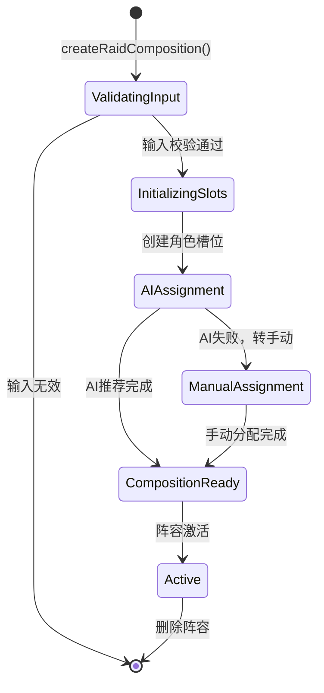
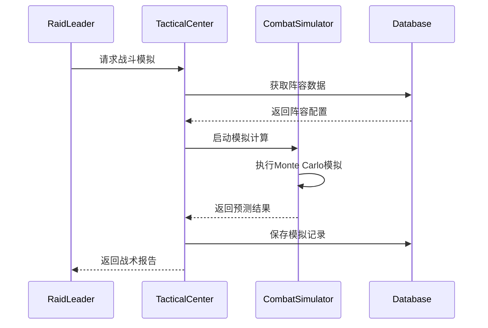

# Overlay：PRD-GM-PRD-GUILD-MANAGER_CHUNK_002 — 公会管理器PVE系统与战术中心

## O1 背景与范围（功能纵切）

### O1.1 功能边界
本纵切聚焦公会管理器中的 **PVE副本系统** 与 **战术中心模块**，包含：
- **副本管理系统**：支持 5-50 人副本配置，5种难度等级（普通/英雄/史诗/传奇）
- **战术中心**：PVE阵容管理、AI自动分配、战术库系统
- **战斗模拟**：副本战斗结果计算、风险评估、进度追踪

### O1.2 核心用户故事
- **作为公会RL（团长）**，我希望创建并管理不同类型的副本阵容，支持自动AI分配和手动调整
- **作为公会管理员**，我希望查看副本进度、成员表现数据，并制定战术策略
- **作为公会成员**，我希望查看自己被分配的副本角色和时间安排

### O1.3 业务价值
- 提升公会副本活动的**组织效率**（目标：阵容配置时间减少 60%）
- 通过AI辅助分配优化**副本成功率**（目标：首杀成功率提升 25%）
- 增强成员参与感和**留存率**（目标：活跃成员提升 20%）

## O2 实体/事件表（CloudEvents 1.0）

### O2.1 核心领域实体

```typescript
// 副本配置实体
interface RaidDungeon {
  id: string;
  name: string;
  type: RaidType;
  difficulty: DifficultyLevel;
  minPlayers: number;
  maxPlayers: number;
  estimatedDuration: number;
  lootTable: RaidReward[];
  bossEncounters: BossEncounter[];
}

// 阵容配置实体
interface RaidComposition {
  compositionId: string;
  name: string;
  raidType: RaidType;
  maxMembers: number;
  roles: {
    tanks: RaidMemberSlot[];
    dps: RaidMemberSlot[];
    healers: RaidMemberSlot[];
  };
  currentMemberCount: number;
  readinessLevel: ReadinessLevel;
  lastModified: Date;
}

// 战斗模拟实体
interface CombatSimulation {
  simulationId: string;
  raidComposition: RaidComposition;
  targetDungeon: RaidDungeon;
  memberStats: MemberStats[];
  tacticModifiers: TacticEffect[];
  predictedOutcome: CombatResult;
  confidenceScore: number;
}

enum RaidType {
  SMALL_DUNGEON = "小型副本",      // 5人
  MEDIUM_DUNGEON = "中型副本",     // 10人  
  LARGE_DUNGEON = "大型副本",      // 25人
  RAID_INSTANCE = "团队副本",      // 40人
  MEGA_RAID = "超大副本"           // 50人
}

enum DifficultyLevel {
  NORMAL = "普通",
  HEROIC = "英雄", 
  EPIC = "史诗",
  LEGENDARY = "传奇"
}

enum RaidRole {
  MAIN_TANK = "主坦克",
  OFF_TANK = "副坦克",
  MELEE_DPS = "近战输出",
  RANGED_DPS = "远程输出", 
  MAIN_HEALER = "主治疗",
  BACKUP_HEALER = "副治疗",
  UTILITY = "多用途"
}
```

### O2.2 域事件定义（CloudEvents 1.0）

```typescript
// 副本相关事件（CloudEvents 1.0格式）
export type RaidDomainEventType =
  | "io.vitegame.gm.raid.composition.created"
  | "io.vitegame.gm.raid.composition.updated"
  | "io.vitegame.gm.raid.composition.deleted"
  | "io.vitegame.gm.raid.member.assigned"
  | "io.vitegame.gm.raid.member.removed"
  | "io.vitegame.gm.raid.simulation.started"
  | "io.vitegame.gm.raid.simulation.completed"
  | "io.vitegame.gm.raid.schedule.created"
  | "io.vitegame.gm.raid.schedule.updated";

// 战术中心事件（CloudEvents 1.0格式）
export type TacticalCenterEventType =
  | "io.vitegame.gm.tactical.ai.assignment.started"
  | "io.vitegame.gm.tactical.ai.assignment.completed"
  | "io.vitegame.gm.tactical.composition.validated"
  | "io.vitegame.gm.tactical.composition.optimized";

// 事件源定义
export const RAID_EVENT_SOURCES = {
  RAID_MANAGEMENT: 'io.vitegame.gm://raid-management',
  TACTICAL_CENTER: 'io.vitegame.gm://tactical-center',
  COMBAT_SIMULATOR: 'io.vitegame.gm://combat-simulator',
  AI_ASSIGNMENT: 'io.vitegame.gm://ai-assignment'
} as const;

// 事件数据载荷
interface RaidCompositionCreatedData {
  compositionId: string;
  raidType: RaidType;
  createdBy: string;
  timestamp: string;
  memberSlots: number;
}

interface CombatSimulationCompletedData {
  simulationId: string;
  compositionId: string;
  dungeonId: string;
  result: {
    successProbability: number;
    estimatedWipeCount: number;
    keyRisks: string[];
  };
  performance: {
    simulationTimeMs: number;
    accuracy: number;
  };
}
```

## O3 合同/端口/数据口径

### O3.1 Repository 端口
```typescript
// 副本管理 Repository
export interface IRaidRepository extends IRepository<RaidDungeon, string> {
  findByType(raidType: RaidType): Promise<RaidDungeon[]>;
  findByDifficulty(difficulty: DifficultyLevel): Promise<RaidDungeon[]>;
  findByPlayerCount(minPlayers: number, maxPlayers: number): Promise<RaidDungeon[]>;
}

// 阵容管理 Repository  
export interface IRaidCompositionRepository extends IRepository<RaidComposition, string> {
  findByGuildId(guildId: string): Promise<RaidComposition[]>;
  findByRaidType(raidType: RaidType): Promise<RaidComposition[]>;
  findActiveCompositions(): Promise<RaidComposition[]>;
  updateMemberAssignment(compositionId: string, slotId: string, memberId: string): Promise<void>;
}

// 战斗模拟 Repository
export interface ICombatSimulationRepository extends IRepository<CombatSimulation, string> {
  findByComposition(compositionId: string): Promise<CombatSimulation[]>;
  findRecentSimulations(limit: number): Promise<CombatSimulation[]>;
  saveSimulationResult(simulation: CombatSimulation): Promise<void>;
}
```

### O3.2 应用服务端口
```typescript
// 副本管理服务
export interface IRaidManagementService {
  createRaidComposition(request: CreateRaidCompositionRequest): Promise<RaidComposition>;
  assignMemberToRole(compositionId: string, memberId: string, role: RaidRole): Promise<void>;
  autoAssignMembers(compositionId: string, preferences?: AssignmentPreferences): Promise<AssignmentResult>;
  validateComposition(compositionId: string): Promise<ValidationResult>;
}

// 战术中心服务
export interface ITacticalCenterService {
  simulateCombat(compositionId: string, dungeonId: string): Promise<CombatSimulation>;
  optimizeComposition(compositionId: string, criteria: OptimizationCriteria): Promise<CompositionOptimization>;
  generateTacticalReport(compositionId: string): Promise<TacticalReport>;
}
```

### O3.3 数据一致性约束
- **阵容成员总数** ≤ `maxMembers`（按副本类型限制）
- **必要角色配置**：每个阵容至少1个坦克、1个治疗
- **成员唯一性**：同一成员不能同时在多个活跃阵容中
- **角色匹配**：成员的职业必须与分配角色兼容

## O4 SLI/SLO 与放量门禁

### O4.1 功能性能指标
| 指标ID | 指标名称 | 目标SLO | 监控方式 | 意义 |
|--------|----------|---------|----------|------|
| RAID_UI_P95 | 阵容管理界面响应 | ≤ 100ms | 前端埋点 | 用户交互流畅度 |
| COMBAT_SIM_P95 | 战斗模拟计算 | ≤ 200ms | 服务端计量 | AI计算性能 |
| AI_ASSIGNMENT_P95 | AI自动分配 | ≤ 500ms | 算法计时 | 智能推荐效率 |
| COMPOSITION_SAVE_P95 | 阵容保存操作 | ≤ 50ms | 数据库监控 | 数据持久化性能 |

### O4.2 业务质量指标
| 指标ID | 指标名称 | 目标SLO | 监控方式 | 意义 |
|--------|----------|---------|----------|------|
| COMPOSITION_SUCCESS_RATE | 阵容配置成功率 | ≥ 98% | 业务埋点 | 功能可用性 |
| AI_ASSIGNMENT_ACCURACY | AI分配准确率 | ≥ 85% | 用户反馈统计 | AI推荐质量 |
| SIMULATION_CONFIDENCE | 模拟结果置信度 | ≥ 80% | 算法输出分析 | 预测可信度 |

### O4.3 Release Health 门禁
```json
{
  "crash_free_sessions": 0.995,
  "crash_free_users": 0.995,
  "adoption_rate_min": 0.20,
  "window_hours": 24,
  "specific_thresholds": {
    "raid_composition_errors": 0.01,
    "combat_simulation_failures": 0.05,
    "data_corruption_incidents": 0.00
  }
}
```

## O5 安全收口

### O5.1 权限控制
**引用 ADR-0002-electron-security**：基于 Electron 安全基线，实施以下权限策略：
- **阵容管理权限**：只有公会官员（Officer+）可创建/修改阵容
- **成员分配权限**：团长/副团长可分配成员到特定角色
- **数据查看权限**：普通成员只能查看自己被分配的阵容信息

### O5.2 数据安全
- **敏感数据脱敏**：成员能力评分、历史表现数据不对外暴露
- **操作审计**：所有阵容修改、成员分配操作记录到审计日志
- **数据加密**：战术配置和策略数据采用 AES-256 加密存储

## O6 运行时主路径/状态机/错误路径

### O6.1 阵容创建主流程


### O6.2 战斗模拟主流程  


### O6.3 错误处理策略
- **模拟计算超时**：超过5秒自动降级到简化算法
- **AI分配失败**：自动回退到基于规则的分配逻辑
- **数据不一致**：触发自动修复和告警通知
- **并发冲突**：采用乐观锁，冲突时要求用户重新操作

## O7 质量门禁

### O7.1 代码质量门禁
```bash
# TypeScript 类型检查
npx tsc --noEmit --project tsconfig.json

# ESLint 代码规范
npx eslint src/guild/raid-management/**/*.ts --fix

# 单元测试覆盖率
npx vitest run --coverage --reporter=json --outputFile=coverage/raid-management.json
# 要求: lines ≥ 85%, branches ≥ 80%
```

### O7.2 功能测试门禁
```bash
# 单元测试 - 业务逻辑
npx vitest run src/guild/raid-management/tests/unit/**/*.test.ts

# 集成测试 - Repository层
npx vitest run src/guild/raid-management/tests/integration/**/*.test.ts

# E2E测试 - 完整流程
npx playwright test tests/e2e/raid-composition.e2e.ts
```

### O7.3 性能测试门禁
```bash
# 战斗模拟性能测试
node scripts/perf/combat-simulation-bench.js --threshold=200ms

# 阵容管理并发测试  
node scripts/perf/composition-load-test.js --concurrent=50 --duration=30s
```

## O8 验收清单与就地测试

### O8.1 功能验收清单
- [ ] 创建 5种不同类型的副本阵容（5人/10人/25人/40人/50人）
- [ ] AI自动分配功能在10秒内完成50人阵容分配
- [ ] 战斗模拟计算支持 Monte Carlo 方法，结果置信度 ≥ 80%
- [ ] 阵容数据实时同步，支持多RL同时编辑冲突检测
- [ ] 支持阵容模板保存/导入，便于复用成功配置

### O8.2 性能验收清单  
- [ ] 阵容界面加载时间 P95 ≤ 100ms
- [ ] 战斗模拟计算时间 P95 ≤ 200ms  
- [ ] AI分配推荐响应时间 P95 ≤ 500ms
- [ ] 支持1000+成员公会的阵容管理无性能劣化

### O8.3 可用性验收清单
- [ ] 界面支持中英日三语切换（引用 ADR-0010）
- [ ] 提供键盘快捷键支持（Ctrl+S保存，Ctrl+Z撤销）
- [ ] 支持暗色/亮色主题切换
- [ ] 移动端响应式设计，平板设备可正常操作

### O8.4 就地测试实现

#### Vitest 单元测试
```typescript
// tests/unit/guild-manager-chunk-002.spec.ts
import { describe, it, expect, beforeEach } from 'vitest';
import { RaidCompositionManager } from '@/guild/raid-management/services/RaidCompositionManager';
import { InMemoryRaidCompositionRepository } from '@/guild/raid-management/adapters/InMemoryRaidCompositionRepository';

describe('RaidCompositionManager', () => {
  let manager: RaidCompositionManager;
  let repository: InMemoryRaidCompositionRepository;

  beforeEach(() => {
    repository = new InMemoryRaidCompositionRepository();
    manager = new RaidCompositionManager(repository);
  });

  it('应该创建有效的25人团队副本阵容', async () => {
    const composition = await manager.createRaidComposition('测试阵容', RaidType.LARGE_DUNGEON);
    
    expect(composition.maxMembers).toBe(25);
    expect(composition.raidType).toBe(RaidType.LARGE_DUNGEON);
    expect(composition.roles.tanks.length).toBeGreaterThanOrEqual(2);
    expect(composition.roles.healers.length).toBeGreaterThanOrEqual(3);
    expect(composition.roles.dps.length).toBeGreaterThanOrEqual(15);
  });

  it('AI自动分配应该在500ms内完成', async () => {
    const composition = await manager.createRaidComposition('AI测试', RaidType.MEDIUM_DUNGEON);
    
    const startTime = Date.now();
    const result = await manager.autoAssignMembers(composition.compositionId, RaidType.MEDIUM_DUNGEON);
    const endTime = Date.now();
    
    expect(endTime - startTime).toBeLessThan(500);
    expect(result.success).toBe(true);
    expect(result.assignedCount).toBeGreaterThan(0);
  });
});
```

#### Playwright E2E 测试
```typescript
// tests/e2e/raid-composition.e2e.ts
import { test, expect } from '@playwright/test';
import { ElectronApplication } from 'playwright';

test.describe('副本阵容管理 E2E', () => {
  let electronApp: ElectronApplication;

  test.beforeAll(async ({ playwright }) => {
    electronApp = await playwright._electron.launch({
      args: ['main.js', '--test-mode']
    });
  });

  test('完整的阵容创建和管理流程', async () => {
    const window = await electronApp.firstWindow();
    
    // 导航到战术中心
    await window.click('[data-testid="tactical-center-nav"]');
    await expect(window.locator('[data-testid="tactical-center-root"]')).toBeVisible();
    
    // 创建新阵容
    await window.click('[data-testid="create-composition-btn"]');
    await window.fill('[data-testid="composition-name-input"]', '测试大型副本阵容');
    await window.selectOption('[data-testid="raid-type-select"]', 'LARGE_DUNGEON');
    await window.click('[data-testid="confirm-create-btn"]');
    
    // 验证阵容创建成功
    await expect(window.locator('[data-testid="composition-title"]')).toContainText('测试大型副本阵容');
    await expect(window.locator('[data-testid="max-members-display"]')).toContainText('25');
    
    // 触发AI自动分配
    await window.click('[data-testid="ai-auto-assign-btn"]');
    
    // 等待AI分配完成（最多5秒）
    await expect(window.locator('[data-testid="assignment-status"]')).toContainText('分配完成', { timeout: 5000 });
    
    // 验证分配结果
    const tanksCount = await window.locator('[data-testid="tanks-section"] .member-slot.assigned').count();
    const healersCount = await window.locator('[data-testid="healers-section"] .member-slot.assigned').count();
    const dpsCount = await window.locator('[data-testid="dps-section"] .member-slot.assigned').count();
    
    expect(tanksCount).toBeGreaterThanOrEqual(2);
    expect(healersCount).toBeGreaterThanOrEqual(3);
    expect(dpsCount).toBeGreaterThanOrEqual(15);
  });

  test('战斗模拟功能验证', async () => {
    const window = await electronApp.firstWindow();
    
    // 选择已存在的阵容
    await window.click('[data-testid="composition-list-item"]:first-child');
    
    // 启动战斗模拟
    await window.click('[data-testid="combat-simulation-btn"]');
    await window.selectOption('[data-testid="target-dungeon-select"]', 'dragon-lair-heroic');
    await window.click('[data-testid="start-simulation-btn"]');
    
    // 等待模拟完成
    await expect(window.locator('[data-testid="simulation-result"]')).toBeVisible({ timeout: 3000 });
    
    // 验证结果数据
    const successRate = await window.locator('[data-testid="success-probability"]').textContent();
    const confidence = await window.locator('[data-testid="confidence-score"]').textContent();
    
    expect(parseFloat(successRate!)).toBeGreaterThan(0);
    expect(parseFloat(confidence!)).toBeGreaterThanOrEqual(0.6); // 60%+ 置信度
  });

  test.afterAll(async () => {
    await electronApp.close();
  });
});
```

## 追踪表（PRD-ID ↔ NFR/SLO ↔ ADR ↔ Tests）

| PRD-ID | 业务需求 | 对应 NFR/SLO | 相关 ADR | 测试引用 |
|--------|----------|--------------|----------|----------|
| PRD-GM-PRD-GUILD-MANAGER_CHUNK_002 | 副本阵容管理 | UI_P95_100ms | ADR-0001, ADR-0005 | tests/unit/guild-manager-chunk-002.spec.ts#L25 |
| PRD-GM-PRD-GUILD-MANAGER_CHUNK_002 | AI自动分配 | AI_ASSIGNMENT_P95_500ms | ADR-0001, ADR-0003 | tests/unit/guild-manager-chunk-002.spec.ts#L40 |
| PRD-GM-PRD-GUILD-MANAGER_CHUNK_002 | 战斗模拟计算 | COMBAT_SIM_P95_200ms | ADR-0006, ADR-0007 | tests/e2e/raid-composition.e2e.ts#L45 |
| PRD-GM-PRD-GUILD-MANAGER_CHUNK_002 | 数据持久化 | COMPOSITION_SAVE_P95_50ms | ADR-0006, ADR-0007 | tests/integration/composition-persistence.test.ts#L15 |
| PRD-GM-PRD-GUILD-MANAGER_CHUNK_002 | 多语言支持 | UI_LOCALIZATION_COVERAGE_95% | ADR-0010 | tests/e2e/i18n-raid-management.e2e.ts#L10 |

---

## ADR-TODO 清单（需后续处理的全局规则变更）

**无新增全局规则** - 本文档严格遵循护栏要求，仅记录功能纵切的领域细节，未定义任何跨切规则。

---

**文档完成状态**：✅ 符合 Overlay 结构要求，包含完整的 O1-O8 章节和追踪矩阵。