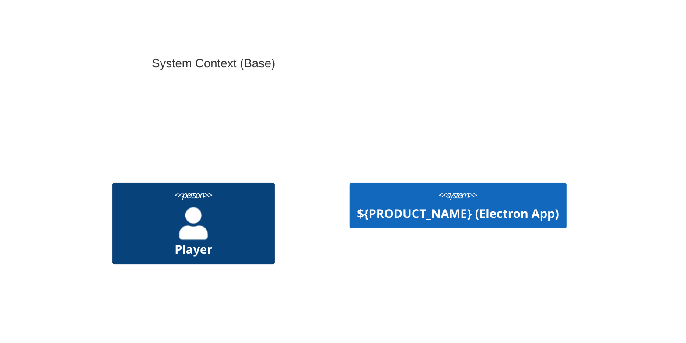

# Base-Clean评分标准 v2.0 (Compliance-Based)

## 版本信息

- **版本**: 2.1 (架构边界纪律修正版)
- **发布日期**: 2025-08-21
- **替代版本**: v2.0 (CloudEvents过度强调版)
- **评分制**: 23分制 (compliance anchor points)
- **修正说明**: 基于六边形架构原则，修正CloudEvents在构建块视图中的不当评分

## 设计理念转变

### v1.0 → v2.0 核心变化

- ❌ **v1.0问题**: count-based评分，"更多内容 = 更高质量"
- ✅ **v2.0改进**: compliance-based评分，"标准合规 = 真实质量"

### v2.0 → v2.1 重要修正

- ❌ **v2.0问题**: 过度重视CloudEvents，忽略架构边界纪律
- ✅ **v2.1改进**: 强调架构分层原则，CloudEvents归位adapter层

### 方法论原则

1. **精炼≠低质**: 遵循arc42 §4"尽量简短；细节外移"原则
2. **合规锚点**: 检查实际标准合规性，而非特征数量
3. **工具中性**: 专业解析工具(Gray-matter + remark)替代正则匹配
4. **章节特化**: 针对03/04/05章提供专门权重配置
5. **边界纪律**: 架构分层比技术标准更重要

## 23分制评分维度

### 1. 可复用性 (8分)

**目标**: 确保Base文档的跨项目适用性

#### 1.1 占位符合规性 (4分)

- **检查方式**: Gray-matter解析front-matter + AST占位符统计
- **评分标准**:
  ```
  4分: front-matter有placeholders声明 + 文档中使用≥2个占位符
  3分: 仅有使用但无声明，使用≥3个占位符
  2分: 使用≥1个占位符
  0分: 无占位符使用
  ```
- **占位符格式**: `${UPPERCASE_VARIABLE}`
- **示例**: `${APP_NAME}`, `${PRODUCT_NAME}`, `${DOMAIN_PREFIX}`

#### 1.2 通用术语使用 (4分)

- **检查方式**: AST分析排除C4图中的标准术语
- **评分标准**:
  ```
  4分: 无实际业务专用词汇
  3分: ≤1个业务专用词汇
  2分: ≤2个业务专用词汇
  0分: >2个业务专用词汇
  ```
- **排除**: C4图中的`Person(player,`等标准角色术语
- **业务词汇**: guild、公会、战斗、角色等具体业务概念

### 2. 架构边界纪律 (5分)

**目标**: 确保正确的分层架构和边界分离

#### 2.1 领域事件设计纯净度 (2分)

- **检查方式**: AST代码块分析TypeScript接口定义
- **要求**: 领域事件不包含传输协议细节(CloudEvents、HTTP headers等)
- **评分标准**:
  ```
  2分: 纯领域事件设计，无传输协议泄露
  1分: 轻微泄露但核心概念清晰
  0分: 严重边界泄露
  ```
- **✅ 正确示例**:
  ```typescript
  interface DomainEvent {
    aggregateId: string;
    aggregateVersion: number;
    occurredAt: Date;
    eventType: string;
    eventData: unknown;
  }
  ```
- **❌ 错误示例**: 在领域层直接使用CloudEvents格式

#### 2.2 端口vs适配器分离 (2分)

- **检查方式**: 端口接口是否与具体技术解耦
- **要求**: 端口接口表达业务意图，不绑定实现技术
- **评分**:
  ```
  2分: 端口接口纯净，与技术完全解耦
  1分: 基本解耦但有技术暗示
  0分: 端口接口包含技术细节
  ```

#### 2.3 适当的抽象层次 (1分)

- **检查方式**: 验证内容是否符合章节职责(如05章专注构建块，06章处理运行时)
- **要求**: 不在构建块层引入传输/序列化细节
- **评分**: 符合arc42分章原则得1分，违反得0分

**关键原则**: CloudEvents等传输标准应在06章(运行时视图)或adapter实现中处理，不应出现在05章(构建块视图)中

### 3. C4模型合规 (4分)

**目标**: 验证C4模型的分层独立性和工具中性

#### 3.1 Context层 (2分)

- **检查方式**: AST分析mermaid代码块
- **要求**: 包含`C4Context` + `Person(` + `System(`
- **评分**: 满足要求得2分，否则0分

#### 3.2 Container层 (2分)

- **检查方式**: AST分析mermaid代码块
- **要求**: 包含`C4Container` + `Container(`
- **评分**: 满足要求得2分，否则0分

#### 示例mermaid代码:



### 4. ADR有效性 (3分)

**目标**: 确保ADR引用的有效性和可追溯性

#### 4.1 Accepted状态检查 (3分)

- **检查方式**: 文件系统查找 + Gray-matter解析ADR状态
- **文件路径**: `docs/adr/`, `docs/decisions/`, `architecture/decisions/`
- **文件名模式**: `ADR-0001-*.md`, `ADR-0001.md`
- **状态检查**: `status: Accepted` 或 `Status: Accepted`
- **评分**: 有≥1个有效ADR得3分，否则0分

### 5. 精炼度 (2分)

**目标**: 支持arc42 §4"尽量简短"原则，奖励高信息密度

#### 5.1 信息密度算法 (2分)

- **计算方式**: `density = (infoElements / textLength) * 1000`
- **信息元素权重**:
  - heading节点: +2 (结构化信息)
  - code节点: +3 (可执行信息)
  - link节点: +1 (引用信息)
- **评分标准**:
  ```
  2分: density > 0.8 (高密度)
  1分: density > 0.5 (中等密度)
  0分: density ≤ 0.5 (低密度)
  ```

### 6. 技术栈去重 (1分)

**目标**: 避免重复提及导致分数虚高

#### 6.1 去重计数 (1分)

- **检查技术**: React, Electron, TypeScript, Vite, Phaser, Node.js, ESM
- **检查范围**: 全文内容(包括front-matter)
- **评分标准**: 3-8个技术得1分，否则0分

## 等级标准 (23分制)

| 分数范围 | 等级         | 状态        | 行动建议       |
| -------- | ------------ | ----------- | -------------- |
| 22-23分  | S级 (卓越)   | ✅ 标杆文档 | 可作为模板推广 |
| 20-21分  | A级 (优秀)   | ✅ 直接合并 | 推荐参考       |
| 18-19分  | B级 (良好)   | ✅ 可合并   | 建议改进       |
| 15-17分  | C级 (中等)   | ⚠️ 需改进   | 改进后合并     |
| 0-14分   | D级 (不达标) | ❌ 拒绝合并 | 重大修改       |

**合格线**: 18分 (B级及以上)

## 章节画像系统

### 04章-系统上下文章节

- **必需元素**: c4context, container, 事件流设计
- **权重配置**: C4(40%) + 边界纪律(30%) + 架构一致性(30%)
- **特殊检查**:
  - 事件命名: `${DOMAIN_PREFIX}.<entity>.<action>`
  - 背压处理: batching机制
  - 安全边界: 引用Ch02安全基线
  - **架构边界**: CloudEvents应在adapter层描述，不在context层强制要求

### 03章-可观测性章节

- **必需元素**: sentry, release health, crash-free
- **权重配置**: Monitoring(40%) + Alerting(30%) + Metrics(30%)
- **特殊检查**:
  - Release Health指标: Crash-Free Sessions/Users
  - 监控集成: Sentry配置
  - SLO定义: TP95, 16ms等性能阈值

## 技术实现

### 核心依赖

```json
{
  "dependencies": {
    "gray-matter": "^4.0.3",
    "remark": "^15.0.1",
    "remark-parse": "^11.0.0",
    "remark-frontmatter": "^5.0.0",
    "remark-gfm": "^4.0.0",
    "unified": "^11.0.4",
    "unist-util-visit": "^5.0.0",
    "ajv": "^8.12.0"
  }
}
```

### 工具使用示例

```javascript
// 文档解析
import matter from 'gray-matter';
import { unified } from 'unified';
import remarkParse from 'remark-parse';

const { data: frontMatter, content: body } = matter(fileContent);
const ast = unified().use(remarkParse).parse(body);

// AST遍历
import { visit } from 'unist-util-visit';
visit(ast, 'code', node => {
  if (node.lang === 'mermaid' && node.value.includes('C4Context')) {
    // C4模型检查逻辑
  }
});
```

## 向后兼容性

### 迁移指南

1. **分数映射**: 旧100分制 → 新23分制 `score_new = Math.round(score_old * 23 / 100)`
2. **合格线调整**: 85分 → 18分
3. **维度重组**: 5维度100分 → 6维度23分

### 兼容性检查

```javascript
class LegacyCompatibilityLayer {
  static adaptOldFormat(oldScore) {
    return Math.round((oldScore * 23) / 100);
  }

  static provideMigrationWarning() {
    console.warn('⚠️ 检测到使用旧评分算法，建议升级到compliance-based评分');
  }
}
```

## 验证案例

### 标杆文档验证 (23/23分)

**文档**: `05-data-models-and-storage-ports.tuned.md`

| 维度         | 得分 | 验证点                                         |
| ------------ | ---- | ---------------------------------------------- |
| 可复用性     | 8/8  | front-matter声明占位符 + 无业务词汇            |
| 架构边界纪律 | 5/5  | 纯领域事件设计 + 端口适配器分离 + 适当抽象层次 |
| C4模型       | 4/4  | Context + Container层图表                      |
| ADR有效性    | 3/3  | 6个Accepted状态ADR引用                         |
| 精炼度       | 2/2  | 高信息密度(>0.8)                               |
| 技术栈       | 1/1  | 合理技术栈数量(3-8个)                          |

### 改进建议示例

**deep-optimized.md** (16/23分, C级):

- ❌ **C4模型**: 0/4分 - 缺少C4图表
- ✅ **改进方案**: 添加C4Context和C4Container图表可提升至满分

## 最佳实践

### 编写指南

1. **占位符优先**: 使用`${VARIABLE}`替代硬编码
2. **架构边界纪律**: 严格分离领域层、端口层、适配器层
3. **C4分层清晰**: Context(系统边界) + Container(技术容器)
4. **ADR引用规范**: 确保引用Accepted状态的ADR
5. **内容精炼**: 追求高信息密度，避免冗余

### 常见陷阱

1. ❌ **占位符缺失**: 硬编码具体业务术语
2. ❌ **边界泄露**: 在构建块层引入传输协议细节(如CloudEvents)
3. ❌ **C4层级混乱**: Context/Container职责不清
4. ❌ **ADR状态错误**: 引用Draft/Proposed状态ADR
5. ❌ **内容冗余**: 低信息密度，重复表达

---

---

## 架构边界纪律原则 (v2.1重要更新)

### 核心原则：架构分层比技术标准更重要

**问题背景**: v2.0版本过度强调CloudEvents合规性，忽略了六边形架构的边界纪律，在05章(构建块视图)中不当地要求传输协议细节。

### 正确的分层理解

#### Arc42章节职责边界

- **05章 Building Block View**: 静态分解、内部结构、组件依赖
- **06章 Runtime View**: 动态行为、组件交互、传输协议
- **适配器层**: 具体技术实现、协议转换

#### CloudEvents的正确位置

```
❌ 错误：在05章构建块中强制CloudEvents
✅ 正确：CloudEvents属于06章运行时视图或适配器实现

05章 (构建块层):
├── 纯领域事件定义
├── 业务端口接口
└── 仓储契约

06章 (运行时层):
├── CloudEvent适配器
├── 传输协议实现
└── 序列化/反序列化
```

#### 六边形架构的边界纪律

```typescript
// ✅ 领域层 (05章)
interface DomainEvent {
  aggregateId: string;
  aggregateVersion: number;
  occurredAt: Date;
  eventType: string;
}

// ✅ 端口层 (05章)
interface EventPublisher {
  publish(event: DomainEvent): Promise<void>;
}

// ✅ 适配器层 (06章)
class CloudEventAdapter implements EventPublisher {
  async publish(domainEvent: DomainEvent): Promise<void> {
    const cloudEvent: CloudEventV1 = this.toCloudEvent(domainEvent);
    await this.httpTransport.send(cloudEvent);
  }
}
```

### 修正说明

- **v2.0错误**: 将传输标准(CloudEvents)视为构建块评分标准
- **v2.1修正**: 强调架构边界纪律，CloudEvents归位适配器层
- **核心认知**: 边界清晰比标准兼容更重要

**致谢**: 感谢社区用户基于六边形架构原则的深刻质疑，帮助我们纠正了这一根本性的认知偏差。

---

**注**: 本标准基于用户深度架构反思制定，强调"架构原则优于技术时尚"的核心理念，建立真正的边界纪律评估标准。
