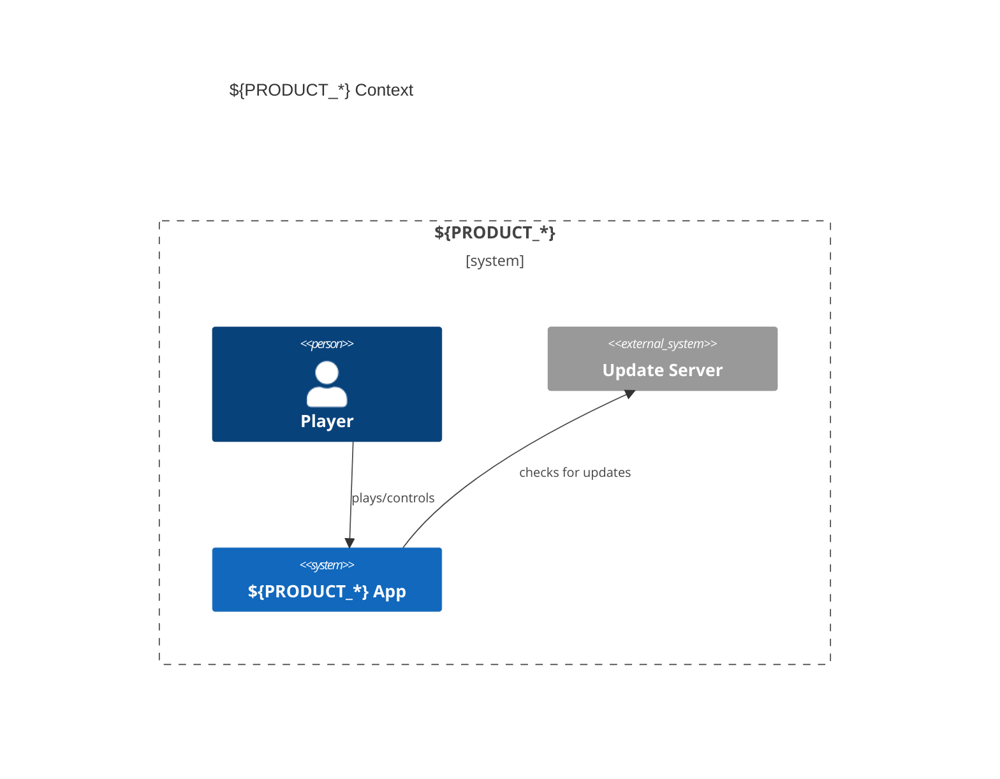

# 技术架构文档（AI 优先 · 清洁 Base 版）

> 目的：作为 **法规中心（SSoT）+ 分章骨架** 的“清洁基线”，支撑后续在 overlays/08 功能纵切中按 PRD 专案扩写。  
> 约定：**不得出现 PRD-ID / Arch-Refs / Test-Refs / 业务词**。请用占位符表达领域信息：`${DOMAIN_*}`、`${PRODUCT_*}`、`${FEATURE_*}`、`${EVENT_*}`、`${DTO_*}`。

## 目录（Base）

01 约束与目标（NFR/SLO/ADR）  
02 安全基线（Electron）  
03 可观测性（Sentry/日志/采样）  
04 系统上下文与 C4 + 事件流  
05 数据模型与存储端口（接口优先）  
06 运行时视图（主/渲染/游戏循环/错误）  
07 开发与构建 + 质量门禁（占位 · 待扩写）  
08 功能纵切（模板，仅在 overlays/PRD 下撰写）  
09 性能与容量规划（占位 · 待扩写）  
10 国际化 · 运维 · 发布（占位 · 待扩写）

---

## 01 约束与目标（NFR/SLO/ADR）

### 1.1 技术栈

- Electron + React + Vite + TypeScript + Tailwind CSS + Phaser 3（可由 ADR-0001 覆盖版本范围）。

### 1.2 范围与假设

- 平台：Windows（主）、macOS（次）。
- 目标分辨率：1080p 基线，可扩展到 HiDPI。

### 1.3 质量目标（NFR 示例，可在 overlays 通过 ADR 调整）

- 可用性：崩溃自由率（Crash-Free Users）≥ 99.5%（生产）；≥ 99.0%（Beta）。
- 性能：渲染帧 P95 ≤ 16.7ms；关键交互 P95 ≤ 100ms；事件处理 P95 ≤ 50ms。
- 安全：最小权限 + 进程隔离；外部资源默认拒绝。
- 观测：关键路径 100% 结构化日志；版本/渠道标识齐全。

### 1.4 决策与变更（ADR）

- 任何落地为代码/测试的变更 **必须引用 ≥1 条 Accepted ADR**；若改变口径，新增 ADR 并 `Supersede` 旧条目。

### 1.5 类型/接口占位（可引用）

```ts
// src/shared/contracts/system.ts
export type DomainEventName = `${string}.${string}.${string}`; // ${DOMAIN}.${entity}.${action}
export interface DomainEvent<TPayload = unknown> {
  name: DomainEventName;
  ts: number;
  payload: TPayload;
  v?: number; // contract version
  traceId?: string;
}
```

### 1.6 就地验收（占位）

```ts
// tests/unit/nfr.contract.spec.ts
import { describe, it, expect } from 'vitest';
describe('NFR/SLO 基线（占位）', () => {
  it('应提供默认 SLO 配置并允许 ENV 覆盖', () => {
    expect(process.env.CRASH_FREE_USERS_GA ?? '99.5').toBeDefined();
  });
});
```

---

## 02 安全基线（Electron）

### 2.1 威胁模型（要点）

- 主/渲染/预加载分权；禁任意文件系统/网络直通。

### 2.2 BrowserWindow / Preload

- `nodeIntegration=false`、`contextIsolation=true`、`sandbox=true`。
- 仅通过 `contextBridge.exposeInMainWorld("<api>", whitelistApi)` 暴露白名单 API。

```ts
// src/main/window.ts（片段）
import { BrowserWindow } from 'electron';
export function createMainWindow() {
  const win = new BrowserWindow({
    webPreferences: {
      contextIsolation: true,
      nodeIntegration: false,
      sandbox: true,
      preload: `${__dirname}/preload.js`,
    },
  });
  return win;
}
```

### 2.3 IPC 策略

- 仅允许白名单 channel；请求/响应类型化；禁止 `remote`。

```ts
// src/shared/contracts/ipc.ts
export type IpcChannel =
  | 'app:getVersion'
  | 'telemetry:track'
  | `${string}:${string}`;
export interface IpcRequest<T> {
  channel: IpcChannel;
  payload: T;
}
export interface IpcResponse<T> {
  ok: boolean;
  data?: T;
  error?: string;
}
```

### 2.4 CSP 与发布安全

- `default-src 'self'`；禁止内联脚本；资源显式白名单。
- 代码签名/公证在 10 章详述（此处保留链接）。

### 2.5 就地验收（Playwright × Electron · 冒烟占位）

```ts
// tests/e2e/electron.smoke.spec.ts
import { _electron as electron, ElectronApplication, Page } from 'playwright';
import { test, expect } from '@playwright/test';

test('窗口可启动且可见（占位）', async () => {
  const app: ElectronApplication = await electron.launch({
    args: ['./dist/main.js'],
  });
  const page: Page = await app.firstWindow();
  await expect(page).toBeVisible();
  await app.close();
});
```

---

## 03 可观测性（Sentry/日志/采样）

### 3.1 目标

- 统一发布健康（Release Health）；结构化日志；最小开销采样。

### 3.2 初始化（主/渲染 · 占位）

```ts
// src/main/observability.ts
import * as Sentry from '@sentry/electron/main';
export function initSentryMain() {
  Sentry.init({
    dsn: process.env.SENTRY_DSN,
    release: process.env.APP_RELEASE,
    environment: process.env.APP_ENV,
    tracesSampleRate: 0.1,
  });
}
```

```ts
// src/renderer/observability.ts
import * as Sentry from '@sentry/electron/renderer';
export function initSentryRenderer() {
  Sentry.init({
    dsn: process.env.SENTRY_DSN,
    release: process.env.APP_RELEASE,
    environment: process.env.APP_ENV,
    tracesSampleRate: 0.1,
  });
}
```

### 3.3 结构化日志

```ts
// src/shared/telemetry/logger.ts
export interface LogFields {
  level: 'debug' | 'info' | 'warn' | 'error';
  appVersion: string;
  env: string;
  prd?: string; // optional PRD tag in overlays
  event?: string;
  message: string;
  ts: number;
}
```

### 3.4 上报可用性门禁（占位脚本）

```ts
// scripts/release_health_check.mjs
import fs from 'node:fs';
const minCrashFree = Number(process.env.CRASH_FREE_USERS_GA ?? 99.5);
const rh = JSON.parse(fs.readFileSync('.release-health.json', 'utf-8'));
if (rh.crashFreeUsers < minCrashFree) {
  console.error('Release Health gate failed');
  process.exit(1);
}
```

---

## 04 系统上下文与 C4 + 事件流

### 4.1 Context & Container（Mermaid 占位）



### 4.2 组件与事件命名

- 事件命名：`\${DOMAIN_PREFIX}.\${entity}.\${action}`；版本字段 `v`。

### 4.3 事件总线接口（占位）

```ts
// src/shared/contracts/event-bus.ts
export interface EventBus {
  publish<T>(evt: import('./system').DomainEvent<T>): Promise<void>;
  subscribe(
    name: import('./system').DomainEventName,
    cb: (e: any) => void
  ): () => void;
}
```

### 4.4 就地验收（占位）

```ts
// tests/unit/event.naming.spec.ts
import { describe, it, expect } from 'vitest';
describe('事件命名规则（占位）', () => {
  it('符合 <domain>.<entity>.<action> 形式', () => {
    const ok = (s: string) => /^\w+\.\w+\.\w+$/.test(s);
    expect(ok('core.unit.test')).toBe(true);
  });
});
```

---

## 05 数据模型与存储端口（接口优先）

### 5.1 端口与仓储接口（占位）

```ts
// src/shared/contracts/ports.ts
export interface Repository<T> {
  getById(id: string): Promise<T | null>;
  upsert(entity: T): Promise<void>;
  list(params?: Record<string, unknown>): Promise<T[]>;
}
```

### 5.2 DTO 与版本化（占位）

```ts
// src/shared/contracts/dto.ts
export interface ${DTO_*} {
  id: string;
  v: number;  // schema version
}
```

### 5.3 就地验收（占位）

```ts
// tests/unit/ports.contract.spec.ts
import { describe, it, expect } from 'vitest';
describe('仓储端口约束（占位）', () => {
  it('应提供 getById/upsert/list', () => {
    expect(['getById', 'upsert', 'list'].sort()).toEqual(
      ['getById', 'list', 'upsert'].sort()
    );
  });
});
```

---

## 06 运行时视图（主/渲染/游戏循环/错误）

### 6.1 循环与状态机（占位）

```ts
// src/shared/runtime/game-loop.ts
export interface GameLoop {
  start(): void;
  stop(): void;
  onTick(cb: (dt: number) => void): void;
}
```

### 6.2 错误路径与降级（占位）

- 捕获未处理异常；UI 弹出最小可诊断信息；记录 traceId 并上报。

### 6.3 就地验收（占位）

```ts
// tests/unit/runtime.loop.spec.ts
import { describe, it } from 'vitest';
describe('GameLoop 基线（占位）', () => {
  it('应支持 start/stop/onTick', () => {
    /* TODO */
  });
});
```

---

## 07 开发与构建 + 质量门禁（占位 · 待扩写）

- 统一脚本入口：`guard:ci` 聚合 typecheck/lint/unit/e2e/安全扫描/Release Health。
- 落盘脚本：`scripts/scan_electron_safety.mjs`、`scripts/quality_gates.mjs`、`scripts/verify_base_clean.mjs`。

## 08 功能纵切（仅在 overlays/PRD 下撰写）

- 在 `docs/architecture/overlays/<PRD-ID>/08/` 按模块撰写；正文**引用**本 Base 的 01/02/03 口径，**禁止复制阈值**。

## 09 性能与容量规划（占位 · 待扩写）

- FPS/事件延迟/内存/CPU 的基线与回归阈值；热区表与压测方法。

## 10 国际化 · 运维 · 发布（占位 · 待扩写）

- 语言包与资源组织；签名/公证/自动更新；Release 通道与放量策略。

---

### 写作纪律（Base 专用）

- Base 扩写时仅使用 `architecture_base.index`，不引入 PRD 语义与文件。
- 任何“可执行规范”必须附带 **契约片段** 与 **就地验收片段**（可占位）。
