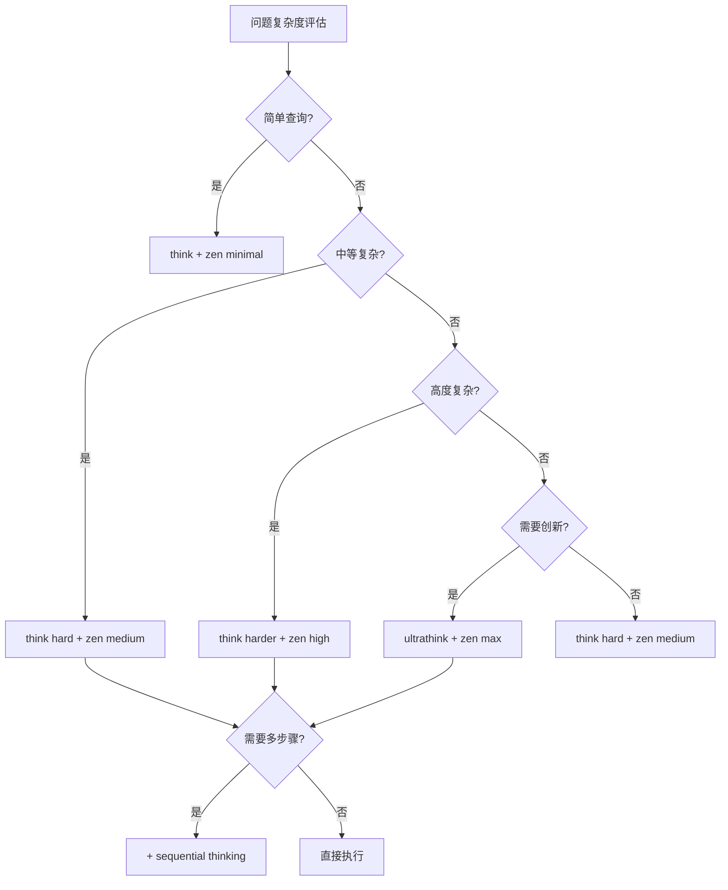

# 思考模式完整组合指南

## 概述

本指南涵盖了 Claude 内置思考模式、Zen MCP 思考工具以及 Sequential Thinking 的所有可能组合，为复杂问题解决提供系统化的方法选择框架。

## 模式指定方法

### 自动模式选择 vs 手动指定
- **自动模式**: Claude 根据问题复杂度自动选择合适的内置思考模式
- **手动指定**: 用户可以显式指定使用特定的思考模式组合

### 指定语法规则

#### 1. Claude 内置思考模式指定
```bash
# 语法：在问题前加上模式指令
[think] 你的问题
[think hard] 你的问题  
[think harder] 你的问题
[ultrathink] 你的问题

# 示例
[think hard] 分析这段代码的性能问题
[ultrathink] 设计一个革命性的游戏引擎架构
```

#### 2. Zen MCP 工具指定
```bash
# 语法：要求使用特定工具和thinking_mode
请使用 mcp__zen-mcp-server__thinkdeep，thinking_mode: "high"
请使用 mcp__zen-mcp-server__chat，thinking_mode: "medium"

# 示例
请使用 mcp__zen-mcp-server__thinkdeep，thinking_mode: "max" 来分析这个架构问题
请使用 mcp__zen-mcp-server__chat，thinking_mode: "low" 来快速讨论这个想法
```

#### 3. Sequential Thinking 工具指定
```bash
# 语法：明确要求使用sequential thinking
请使用 mcp__sequential-thinking__sequentialthinking 来逐步解决这个问题

# 示例
请使用 mcp__sequential-thinking__sequentialthinking 来分步设计用户认证系统
```

#### 4. 组合模式指定
```bash
# 语法：同时指定多个模式
[think harder] + 请使用 mcp__zen-mcp-server__thinkdeep，thinking_mode: "high" + sequential thinking

# 示例
[ultrathink] + 请使用 mcp__zen-mcp-server__chat，thinking_mode: "max" + sequential thinking 来创新性地解决这个技术难题
```

## 1. 基础组合矩阵 (Claude内置 × Zen MCP)

### think + minimal 组合 ⭐⭐⭐⭐⭐
**适用场景**: 简单查询，快速回答
**自动触发示例**: 
```bash
用户："npm run dev 命令是什么作用？"
Claude自动选择：think + minimal模式
结果：直接回答"启动Vite开发服务器进行热重载开发"
```
**手动指定示例**:
```bash
用户："[think] 请解释npm run dev命令的作用"
Claude按指定执行：使用基础思考模式
结果：简洁回答而不会过度分析
```

### think + low 组合 ⭐⭐⭐⭐
**适用场景**: 基础分析任务
**示例**: 
```bash
问题："为什么我的Tailwind样式没有生效？"
使用：检查配置文件、CSS导入和构建设置
结果：发现Tailwind v4配置方式与v3不同，给出具体修复步骤
```

### think + medium 组合 ⭐⭐⭐
**适用场景**: 一般开发问题
**示例**: 
```bash
问题："如何优化Phaser游戏的渲染性能？"
使用：分析渲染管线、纹理管理和对象池策略
结果：提供5个具体优化建议和代码示例
```

### think + high 组合 ⭐⭐
**适用场景**: 复杂但不需深度推理的任务
**示例**: 
```bash
问题："设计一个完整的用户认证系统架构"
使用：覆盖JWT、OAuth、权限管理等多个方面
结果：详细架构图和实现路线图，但可能过于复杂
```

### think + max 组合 ⭐ (不推荐)
**适用场景**: 浪费资源的组合
**示例**: 
```bash
问题："如何安装一个npm包？"
使用：过度分析包管理、依赖树、安全性等
结果：简单问题得到过于复杂的回答，效率低下
```

### think hard + minimal 组合 ⭐ (不推荐)
**适用场景**: 不匹配的组合
**示例**: 
```bash
问题："分析这个复杂的状态管理bug"
使用：深度思考但输出极简
结果：思考充分但输出不完整，浪费计算资源
```

### think hard + low 组合 ⭐⭐⭐
**适用场景**: 中等复杂度调试
**示例**: 
```bash
问题："React组件渲染异常，性能下降严重"
使用：深入分析组件生命周期和渲染过程
结果：定位到useEffect依赖问题和重复渲染原因
```

### think hard + medium 组合 ⭐⭐⭐⭐⭐
**适用场景**: 架构设计问题
**自动触发示例**: 
```bash
用户："设计Electron主进程与渲染进程的通信架构"
Claude自动选择：think hard + medium输出
结果：完整的通信协议设计，包含错误处理和安全策略
```
**手动指定示例**:
```bash
用户："[think hard] 请使用 mcp__zen-mcp-server__thinkdeep，thinking_mode: 'medium' 来设计Electron的IPC通信架构"
Claude按指定执行：深度思考 + 中等详度的系统化分析
结果：结构化的多步骤架构设计过程，包含调查→设计→验证阶段
```

### think hard + high 组合 ⭐⭐⭐⭐
**适用场景**: 复杂系统分析
**示例**: 
```bash
问题："分析微服务拆分策略和数据一致性"
使用：深入分析领域边界、事务模式和一致性保证
结果：详细的拆分方案、数据同步策略和容错机制
```

### think hard + max 组合 ⭐⭐⭐
**适用场景**: 极其复杂的架构决策
**示例**: 
```bash
问题："设计支持百万用户的实时游戏服务器架构"
使用：深度分析负载均衡、状态同步、网络优化等
结果：企业级架构方案，但可能过度工程化
```

### think harder + minimal 组合 ⭐ (严重不匹配)
**适用场景**: 不推荐使用
**示例**: 
```bash
问题："解决分布式系统的数据一致性问题"
使用：极深度思考但极简输出
结果：大量计算资源浪费，输出不完整
```

### think harder + low 组合 ⭐ (不匹配)
**适用场景**: 不推荐使用
**示例**: 
```bash
问题："优化复杂的图形渲染算法"
使用：深层算法分析但输出受限
结果：思考深度与输出详度不匹配
```

### think harder + medium 组合 ⭐⭐⭐
**适用场景**: 复杂安全分析
**示例**: 
```bash
问题："分析Electron应用的安全威胁模型"
使用：深入分析攻击向量、防护策略和合规要求
结果：全面的安全评估报告和加固建议
```

### think harder + high 组合 ⭐⭐⭐⭐⭐
**适用场景**: 多系统集成问题
**示例**: 
```bash
问题："设计跨平台游戏引擎的插件系统架构"
使用：深度分析插件隔离、API设计、热加载机制
结果：完整的插件框架设计，包含开发者工具链
```

### think harder + max 组合 ⭐⭐⭐⭐
**适用场景**: 企业级架构设计
**示例**: 
```bash
问题："设计支持多租户的云原生游戏平台"
使用：深度分析容器化、服务网格、数据隔离等
结果：完整的云平台架构，包含运维和监控体系
```

### ultrathink + minimal 组合 ⭐ (严重浪费)
**适用场景**: 不推荐使用
**示例**: 
```bash
问题："创新性的AI辅助游戏设计理念"
使用：突破性思考但极简输出
结果：大量创新思考被压缩到极简回答中
```

### ultrathink + low 组合 ⭐ (不匹配)
**适用场景**: 不推荐使用
**示例**: 
```bash
问题："重新定义游戏引擎架构范式"
使用：革命性思考但输出受限
结果：创新潜力被输出限制削弱
```

### ultrathink + medium 组合 ⭐ (不匹配)
**适用场景**: 不推荐使用
**示例**: 
```bash
问题："设计下一代编程范式"
使用：极深层思考但中等输出
结果：突破性想法无法完整表达
```

### ultrathink + high 组合 ⭐⭐⭐
**适用场景**: 前沿技术研究
**示例**: 
```bash
问题："探索WebAssembly在游戏引擎中的革命性应用"
使用：突破性思考分析新技术范式
结果：前沿技术应用方案和实验性架构设计
```

### ultrathink + max 组合 ⭐⭐⭐⭐⭐
**适用场景**: 突破性架构创新
**自动触发示例**: 
```bash
用户："设计基于量子计算的游戏物理引擎概念框架"
Claude自动识别：极高复杂度创新问题
结果：突破性的理论框架和技术路线图
```
**手动指定示例**:
```bash
用户："[ultrathink] 请使用 mcp__zen-mcp-server__chat，thinking_mode: 'max' 来探索量子计算在游戏物理引擎中的革命性应用"
Claude按指定执行：突破性思考 + 最大深度输出 + 协作讨论模式
结果：详尽的理论探索、技术可行性分析、实施路线图和风险评估
```

## 2. 增强组合 (+Sequential Thinking)

### 组合1: think hard + zen medium + sequential ⭐⭐⭐⭐⭐
**适用**: 游戏功能模块设计、PRD分解
**自动触发示例**: 
```bash
用户："设计完整的工会管理系统"
Claude识别：复杂多步骤设计任务，自动选择组合模式
结果：完整的功能模块设计文档，包含所有实现细节
```
**手动指定示例**:
```bash
用户："[think hard] 请使用 mcp__zen-mcp-server__thinkdeep，thinking_mode: 'medium'，并使用 mcp__sequential-thinking__sequentialthinking 来设计工会管理系统"
Claude按指定执行：深度思考 + 中等复杂度系统化调查 + 逐步推理
执行流程：
1. Sequential Step 1: 深度分析需求和用户故事
2. Sequential Step 2: 系统化设计数据模型和API
3. Sequential Step 3: 逐步规划UI组件和交互流程  
4. Sequential Step 4: 制定完整测试策略和验收标准
结果：结构化的多阶段设计文档，每个步骤都有详细的调查和验证过程
```

### 组合2: think harder + zen high + sequential ⭐⭐⭐⭐⭐
**适用**: 系统架构重构、技术选型分析
**示例**: 
```bash
问题："从Electron迁移到Tauri的完整方案"
步骤：
1. 评估现有架构依赖 (sequential step 1)
2. 分析迁移风险和成本 (sequential step 2)
3. 设计分阶段迁移策略 (sequential step 3)
4. 制定回滚和测试计划 (sequential step 4)
结果：详细的技术迁移路线图和风险控制方案
```

### 组合3: ultrathink + zen max + sequential ⭐⭐⭐⭐⭐
**适用**: 全新技术栈设计、突破性功能实现
**示例**: 
```bash
问题："设计基于WebXR的下一代游戏开发框架"
步骤：
1. 探索WebXR技术边界和可能性 (sequential step 1)
2. 设计革命性的开发者体验 (sequential step 2)
3. 构建核心框架架构 (sequential step 3)
4. 规划生态系统和社区策略 (sequential step 4)
结果：突破性的技术框架和完整的生态规划
```

### 组合4: think hard + zen medium + sequential ⭐⭐⭐⭐
**适用**: 复杂bug定位、性能优化分析
**示例**: 
```bash
问题："游戏在特定场景下帧率急剧下降"
步骤：
1. 收集性能数据和错误日志 (sequential step 1)
2. 分析渲染管线和内存使用 (sequential step 2)
3. 定位具体的性能瓶颈 (sequential step 3)
4. 实施优化方案和验证 (sequential step 4)
结果：系统化的性能问题解决方案
```

### 组合5: think harder + zen high + sequential ⭐⭐⭐⭐
**适用**: 大型项目架构、团队协作流程
**示例**: 
```bash
问题："建立100人游戏开发团队的技术协作体系"
步骤：
1. 分析团队结构和技能分布 (sequential step 1)
2. 设计代码仓库和分支策略 (sequential step 2)
3. 建立CI/CD和质量门禁 (sequential step 3)
4. 制定文档和知识管理规范 (sequential step 4)
结果：完整的企业级开发流程和协作规范
```

## 3. 专用工具组合建议

### Electron安全分析: ultrathink + zen max + thinkdeep + sequential
**示例场景**: "建立Electron应用的零信任安全架构"
```bash
工作流：
1. thinkdeep调查现有安全威胁
2. ultrathink探索零信任安全模型
3. sequential规划实施步骤
4. zen max输出完整安全策略
```

### Phaser游戏架构: think harder + zen high + chat + sequential
**示例场景**: "设计支持百万用户的实时多人游戏架构"
```bash
工作流：
1. chat协作讨论技术选型
2. think harder深度分析架构模式
3. sequential分步设计实现
4. zen high输出详细架构文档
```

### React 19 + Tailwind v4 迁移: think hard + zen medium + thinkdeep
**示例场景**: "从React 18 + Tailwind v3迁移到最新版本"
```bash
工作流：
1. thinkdeep调查迁移影响范围
2. think hard分析兼容性问题
3. zen medium输出迁移指南
```

### BMAD系统集成: think + zen low + chat
**示例场景**: "快速集成BMAD代理到开发工作流"
```bash
工作流：
1. chat了解BMAD功能
2. think分析集成方式
3. zen low输出配置步骤
```

### 质量门禁设计: think harder + zen high + sequential
**示例场景**: "建立全面的代码质量和安全检查体系"
```bash
工作流：
1. sequential分步设计检查流程
2. think harder深度分析质量指标
3. zen high输出完整门禁配置
```

## 4. 成本效益分析表

| 组合类型 | 计算成本 | 时间成本 | 输出质量 | 适用场景 | ROI评级 |
|----------|----------|----------|----------|----------|---------|
| think + minimal | 极低 | 极快(秒级) | 中等 | 日常查询 | ⭐⭐⭐⭐⭐ |
| think hard + medium | 中等 | 中等(分钟级) | 高 | 功能开发 | ⭐⭐⭐⭐ |
| think harder + high | 高 | 慢(十分钟级) | 极高 | 架构设计 | ⭐⭐⭐ |
| ultrathink + max | 极高 | 极慢(小时级) | 卓越 | 技术创新 | ⭐⭐ |

## 5. 实际使用决策树



## 6. 避免的反模式

### ❌ 资源浪费型反模式

**ultrathink + minimal 反模式**
```bash
错误示例："如何创建一个div元素？"
浪费：用突破性思考解决基础问题
正确：think + minimal
```

**think + max 反模式**
```bash
错误示例："npm install是什么？"
浪费：基础思考配过度详细输出
正确：think + minimal
```

### ❌ 不平衡型反模式

**think harder + minimal 反模式**
```bash
错误示例："设计分布式系统架构"
问题：深度思考但输出过简
正确：think harder + high + sequential
```

### ❌ 过度工程型反模式

**所有问题都用ultrathink + max**
```bash
错误：将最高级组合应用于所有问题
后果：资源浪费、响应缓慢、成本高昂
正确：根据问题复杂度选择合适组合
```

## 7. 最佳实践建议

### 起始策略
1. **新手推荐**: 从 `think hard + zen medium` 开始
2. **逐步升级**: 根据问题复杂度调整
3. **成本控制**: 优先使用高ROI组合

### 项目特定建议

**Electron + Phaser 游戏项目**:
- 日常开发: `think + zen low`
- 功能设计: `think hard + zen medium + sequential`
- 架构决策: `think harder + zen high + sequential`
- 技术创新: `ultrathink + zen max + sequential`

### 团队协作建议
- 制定团队内的思考模式使用规范
- 建立成本预算和效果评估机制
- 培训团队成员选择合适的组合

## 8. 快速指定指南

### 常用指定模板

#### 简单问题快速处理
```bash
[think] 你的简单问题
# 示例：[think] 如何安装npm包？
```

#### 中等复杂度标准处理  
```bash
[think hard] 请使用 mcp__zen-mcp-server__thinkdeep，thinking_mode: "medium" 来分析这个问题
# 示例：[think hard] 请使用 mcp__zen-mcp-server__thinkdeep，thinking_mode: "medium" 来优化这个React组件的性能
```

#### 复杂架构设计
```bash
[think harder] 请使用 mcp__zen-mcp-server__thinkdeep，thinking_mode: "high" 并使用 mcp__sequential-thinking__sequentialthinking 来解决这个架构问题
# 示例：[think harder] 请使用 mcp__zen-mcp-server__thinkdeep，thinking_mode: "high" 并使用 sequential thinking 来设计微服务拆分方案
```

#### 创新性技术探索
```bash  
[ultrathink] 请使用 mcp__zen-mcp-server__chat，thinking_mode: "max" 并使用 mcp__sequential-thinking__sequentialthinking 来创新性地解决这个问题
# 示例：[ultrathink] 请使用 mcp__zen-mcp-server__chat，thinking_mode: "max" 并使用 sequential thinking 来探索WebAssembly在游戏引擎中的革命性应用
```

### 指定的优势

#### 精确控制
- **成本控制**: 避免过度使用高成本模式
- **时间控制**: 根据紧急程度选择合适速度
- **质量控制**: 重要决策使用高质量模式

#### 学习优化  
- **效果对比**: 同一问题尝试不同模式对比效果
- **个人偏好**: 找到最适合自己的模式组合
- **团队规范**: 建立团队统一的模式使用标准

#### 特殊场景适配
- **演示场景**: 需要详细过程展示时使用sequential thinking
- **头脑风暴**: 使用chat模式进行协作思考
- **深度调研**: 使用thinkdeep进行系统化调查

### 模式选择决策表

| 问题特征 | 推荐指定方式 | 原因 |
|---------|-------------|------|
| 简单查询 | `[think]` | 快速高效，无需过度分析 |
| 功能开发 | `[think hard] + thinkdeep medium` | 平衡深度与效率 |
| 架构设计 | `[think harder] + thinkdeep high + sequential` | 需要系统化多步骤分析 |
| 技术创新 | `[ultrathink] + chat max + sequential` | 突破性思考与协作验证 |
| 紧急bug修复 | `[think hard] + thinkdeep medium` | 深度分析但快速输出 |
| 长期规划 | `[think harder] + chat high + sequential` | 需要深思熟虑和分步规划 |

---

**文档版本**: v1.1  
**最后更新**: 2025-08-20  
**维护者**: Claude Code + BMAD 协作系统  
**更新内容**: 新增模式手动指定方法和快速指定指南